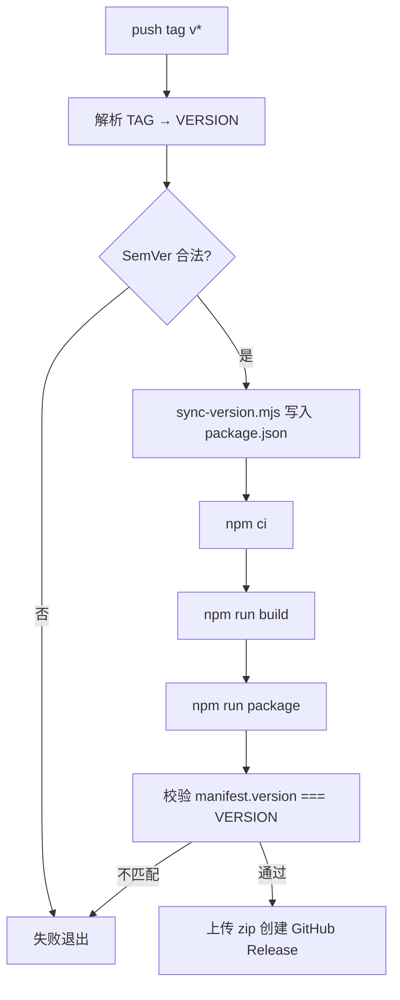

# 开发指南

本文介绍 DirectPreview 的本地开发、版本号规则，以及通过 Git Tag 触发自动发布的流程。

---

## 版本号从哪里来？

本项目采用 **语义化版本（SemVer）**，版本号由 **Git Tag 决定**，构建时写入扩展 manifest。

```
Git Tag          package.json        Chrome manifest
────────         ─────────────       ───────────────
v1.2.3    →      version: 1.2.3  →  version: 1.2.3
```

| 位置 | 说明 |
|------|------|
| **Git Tag** | 发布唯一来源，格式 `vX.Y.Z`（如 `v1.0.0`） |
| **`package.json` → `version`** | Plasmo 构建时读取，CI 中由 tag 同步写入 |
| **`build/.../manifest.json` → `version`** | 扩展在 `chrome://extensions` 中显示的版本 |

> 日常开发时 `package.json` 里的版本仅作参考；**正式发布以 tag 为准**，CI 会在构建前覆盖为 tag 对应版本。

### Tag 命名规则

| 格式 | 示例 | 是否支持 |
|------|------|----------|
| `v主.次.修订` | `v1.0.0`、`v2.3.1` | ✅ |
| 预发布 | `v1.0.0-beta.1` | ✅ |
| 构建元数据 | `v1.0.0+build.1` | ✅ |
| 无 `v` 前缀 | `1.0.0` | ❌ 不会触发 Release workflow |
| 非 SemVer | `v1.0`、`release-1` | ❌ CI 校验失败 |

Tag 去掉前缀 `v` 后即为 manifest 版本号：

- `v1.2.3` → manifest `1.2.3`
- `v1.0.0-beta.1` → manifest `1.0.0-beta.1`

---

## 本地开发

```bash
npm install
npm run dev
```

1. 打开 `chrome://extensions/`，开启 **开发者模式**
2. **加载已解压的扩展程序** → 选择 `build/chrome-mv3-dev`
3. 修改代码后 Plasmo 会自动热重载

本地构建生产包（不发布）：

```bash
npm run build    # 产物：build/chrome-mv3-prod/
npm run package  # 打包：build/chrome-mv3-prod.zip
```

### 本地同步版本号（可选）

若想在本地手动把 `package.json` 改成指定版本再构建：

```bash
npm run version:sync 1.2.3
npm run build
```

脚本路径：`scripts/sync-version.mjs`

---

## 发布流程

发布 **不需要** 事先改 `package.json` 再提交，只需打 tag 并推送。

### 1. 确保代码已合并到主分支

```bash
git checkout master
git pull origin master
```

### 2. 创建并推送 Tag

```bash
# 新版本示例
git tag v1.1.0
git push origin v1.1.0
```

### 3. 等待 GitHub Actions

打开仓库 **Actions** → 工作流 **Release**，等待运行完成。

### 4. 下载 Release 产物

在 **Releases** 页面获取：

| 文件 | 用途 |
|------|------|
| `chrome-mv3-prod.zip` | 商店提交 / 直接分发 |
| `direct-preview-{version}.zip` | 带版本号的同名副本，便于归档 |

---

## Release Workflow 逻辑

工作流文件：`.github/workflows/release.yml`

### 触发条件

```yaml
on:
  push:
    tags:
      - "v*"
```

| 事件 | 是否触发 |
|------|----------|
| `git push origin v1.0.0` | ✅ 触发 |
| `git push origin master`（无 tag） | ❌ 不触发 |
| 在 GitHub 网页创建 Release 并生成 tag | ✅ 推送 tag 后触发 |

### 执行步骤（按顺序）



| 步骤 | 作用 |
|------|------|
| **Resolve version from tag** | 从 `GITHUB_REF_NAME` 取 tag，去掉 `v` 得到 `VERSION`，正则校验 SemVer |
| **Sync package.json version** | 运行 `node scripts/sync-version.mjs "$VERSION"` |
| **Build / Package** | `npm run build` + `npm run package` 生成 `chrome-mv3-prod.zip` |
| **Verify manifest version** | 读取 `build/chrome-mv3-prod/manifest.json`，必须与 tag 版本一致，否则失败 |
| **Create GitHub Release** | 上传 zip，自动生成 Release Notes |

### 并发控制

同一 tag 重复推送时，使用 `concurrency: release-${{ github.ref }}`，避免并行发布冲突。

---

## 版本号与扩展 manifest 的关系

Plasmo 从 `package.json` 的 `version` 字段生成 Chrome MV3 manifest：

```json
// build/chrome-mv3-prod/manifest.json（构建产物）
{
  "version": "1.2.3",
  "manifest_version": 3,
  ...
}
```

因此 Release 流程的核心是：

1. **Tag 是唯一真相来源**
2. CI 先把 tag 同步进 `package.json`
3. 再构建，保证 manifest 与 tag 一致
4. 构建后 **二次校验** manifest，防止 Plasmo 或配置异常导致版本漂移

---

## 其他 Workflow

| 文件 | 触发 | 用途 |
|------|------|------|
| `release.yml` | 推送 `v*` tag | 自动构建并发布 GitHub Release |
| `submit.yml` | 手动 `workflow_dispatch` | 构建并提交 Chrome Web Store（需配置 `SUBMIT_KEYS`） |

商店提交流程与 tag 发布独立；通常先走 **Release** 验证产物，再手动触发 **Submit to Web Store**。

---

## 常见问题

### 推送 tag 后没有 Release？

- 检查 tag 是否以 `v` 开头（如 `v1.0.0`，不是 `1.0.0`）
- 查看 Actions 日志是否 SemVer 校验失败
- 确认 workflow 文件已在默认分支上

### manifest 版本和 tag 不一致？

Release 会在 **Verify manifest version** 步骤失败。检查 `package.json` 是否被 Plasmo 正确读取，或本地运行：

```bash
node scripts/sync-version.mjs 1.2.3
npm run build
node -e "console.log(require('./build/chrome-mv3-prod/manifest.json').version)"
```

### 发错了 tag 怎么办？

- 若 Release 未完成：删除远程 tag 后重新打正确的 tag
- 若已发布：打新 tag（如 `v1.0.1`）发布修正版；**不要** force 改写已发布的 tag

```bash
# 仅当 Release 失败、需要重打时（慎用）
git tag -d v1.0.0
git push origin :refs/tags/v1.0.0
git tag v1.0.0
git push origin v1.0.0
```

---

## 相关文件

| 路径 | 说明 |
|------|------|
| `.github/workflows/release.yml` | Tag 触发自动发布 |
| `scripts/sync-version.mjs` | 将版本号写入 `package.json` |
| `package.json` → `version` | Plasmo 构建版本来源 |
| `build/chrome-mv3-prod/manifest.json` | 扩展最终版本（构建产物） |
