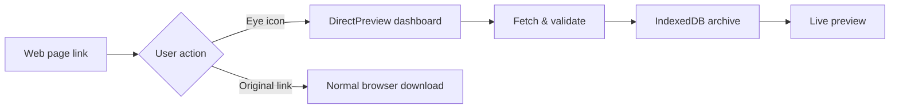

<div align="center">

# DirectPreview

**Preview Office & PDF documents in the browser — no download required.**

[](https://developer.chrome.com/docs/extensions/mv3/)
[](https://docs.plasmo.com/)
[](https://react.dev/)

[English](README.md) · [简体中文](README.zh-CN.md)

</div>

---

## Overview

**DirectPreview** is a Chrome extension that adds a subtle **eye icon** next to document download links on any webpage. Click the icon to preview instantly; click the original link to download as usual.

Files are cached locally in **IndexedDB**, so you get a personal document hub with history, rename, batch download, and eye-friendly themes — all without leaving the browser.



---

## Features

| | Feature | Description |
|---|---------|-------------|
| 👁 | **Non-intrusive preview** | Eye button beside links; original download behavior unchanged |
| 📄 | **Multi-format** | `.xlsx` · `.docx` · `.doc` · `.pdf` |
| 📊 | **Excel power view** | Global search, per-column filter & sort ([TanStack Table](https://tanstack.com/table)) |
| 🗂 | **Local archive** | Up to 200 files in IndexedDB with sidebar history |
| ⬇ | **Flexible export** | Instant blob download or re-download from source URL |
| 🎨 | **Eye-care themes** | Default · green · warm · blue + dot-grid canvas |
| 🌍 | **10 languages** | zh · en · ja · es · fr · de · ko · pt-BR · ru · it |
| 🔒 | **Security checks** | URL validation, size cap (100 MB), magic-byte sniffing, HTML response guard |

---

## Supported formats

| Extension | Engine | Notes |
|-----------|--------|-------|
| `.xlsx` | [SheetJS](https://sheetjs.com/) | Multi-sheet, filterable data grid |
| `.docx` | [docx-preview](https://github.com/VolodymyrBaydalka/docxjs) | Layout-preserving render |
| `.doc` | [word-extractor](https://www.npmjs.com/package/word-extractor) | Legacy format, text mode |
| `.pdf` | [PDF.js](https://mozilla.github.io/pdf.js/) | Paginated canvas render |

> `.doc` files mislabeled as `.docx` are auto-detected and routed to the correct viewer.

---

## How it works

### 1 · Link enhancement (content script)

On every page, DirectPreview scans for document download links and injects a compact eye button.

| Action | Result |
|--------|--------|
| Click **original link** | Browser downloads normally |
| Click **eye icon** | Opens preview tab with filename from link text |

Smart filename parsing handles labels like `附件：report.xlsx` and strips garbage names (`document.bin`, numeric IDs).

### 2 · Dashboard

Click the **toolbar icon** to open the main dashboard — your document command center.

- **Sidebar** — history, filename filter, multi-select batch download
- **Preview area** — themed dot-grid canvas with embedded viewer
- **Toolbar** — rename, download, delete (with confirmation)
- **Import** — drag-and-drop or `+` button for local files

### 3 · Fetch & store

When previewing from a URL:

1. Read target from URL params or session storage (for long URLs)
2. `fetch` with credentials (cookies) and redirect follow
3. Validate protocol, size, content-type, and file magic bytes
4. Persist blob to IndexedDB and render

### 4 · Settings

Open **⚙ Settings** from the sidebar.

| Option | Choices |
|--------|---------|
| **Language** | Auto-detect + 10 manual locales |
| **Theme** | Default · Eye-care green · warm · blue |

Dot-grid background is always on — part of the default visual style.

---

## Project structure

```
DirectPreview/
├── src/
│   ├── background.ts              # Service worker: routing & native download
│   ├── contents/link-capture.ts   # Eye icon injection on web pages
│   ├── tabs/
│   │   ├── preview.tsx            # Main dashboard
│   │   └── settings.tsx           # Theme & language settings
│   ├── components/                # Excel / Word / PDF viewers
│   ├── db/index.ts                # Dexie.js IndexedDB layer
│   ├── providers/                 # App settings context
│   └── utils/                     # File I/O, i18n, security, link parsing
├── locales/                       # Chrome i18n message bundles
├── logo.svg                       # Shared eye logo
└── assets/                        # Extension icons
```

---

## Development

### Prerequisites

- Node.js 18+
- Google Chrome / Chromium

### Setup

```bash
git clone <repo-url>
cd DirectPreview
npm install
npm run dev
```

### Load unpacked extension

1. Open `chrome://extensions/`
2. Enable **Developer mode**
3. Click **Load unpacked** → select `build/chrome-mv3-dev`
4. Edit source — Plasmo hot-reloads automatically

### Production build

```bash
npm run build
# Output → build/chrome-mv3-prod/
```

Package for distribution:

```bash
npm run package
```

---

## Tech stack

| Layer | Technology |
|-------|------------|
| Extension framework | [Plasmo](https://docs.plasmo.com/) |
| UI | React 18 + Tailwind CSS |
| Storage | Dexie.js (IndexedDB) |
| Tables | TanStack React Table |
| i18n | Chrome `_locales` + runtime locale switch |

---

## Permissions

| Permission | Why |
|------------|-----|
| `storage` | User settings & session preview payload |
| `tabs` | Open / focus dashboard & preview tabs |
| `downloads` | Optional native re-download from source URL |
| `<all_urls>` | Inject eye icon & fetch remote documents |

---

## Author

**Shaolong Ren**

---

<div align="center">

If DirectPreview saves you a download or two, consider giving it a ⭐

</div>
