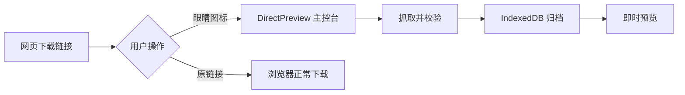

<div align="center">

# DirectPreview

**网页文档免下载即时预览插件**

[](https://developer.chrome.com/docs/extensions/mv3/)
[](https://docs.plasmo.com/)
[](https://react.dev/)

[English](README.md) · [简体中文](README.zh-CN.md)

</div>

---

## 简介

**DirectPreview** 是一款 Chrome 扩展：在网页上的文档下载链接旁注入 **眼睛图标**，点图标即可在浏览器内预览，点原链接则照常下载。

文件会归档到本地 **IndexedDB**，形成你的私人文档中心——支持历史记录、重命名、批量下载和护眼主题，全程无需离开浏览器。



---

## 功能亮点

| | 功能 | 说明 |
|---|------|------|
| 👁 | **无感预览** | 链接旁显示眼睛按钮，不干扰原有下载行为 |
| 📄 | **多格式** | 支持 `.xlsx` · `.docx` · `.doc` · `.pdf` |
| 📊 | **Excel 增强** | 全局搜索、列筛选与排序（[TanStack Table](https://tanstack.com/table)） |
| 🗂 | **本地归档** | IndexedDB 存储，最多 200 条历史记录 |
| ⬇ | **灵活导出** | 内存直出下载，或从原网址重新下载 |
| 🎨 | **护眼主题** | 默认 / 护眼绿 / 护眼黄 / 护眼蓝 + 点阵画布 |
| 🌍 | **10 种语言** | 中 · 英 · 日 · 西 · 法 · 德 · 韩 · 葡 · 俄 · 意 |
| 🔒 | **安全校验** | URL 校验、100 MB 上限、魔数识别、HTML 响应拦截 |

---

## 支持格式

| 格式 | 渲染引擎 | 说明 |
|------|----------|------|
| `.xlsx` | [SheetJS](https://sheetjs.com/) | 多工作表、可筛选数据表格 |
| `.docx` | [docx-preview](https://github.com/VolodymyrBaydalka/docxjs) | 保留排版预览 |
| `.doc` | [word-extractor](https://www.npmjs.com/package/word-extractor) | 旧版格式，文本模式 |
| `.pdf` | [PDF.js](https://mozilla.github.io/pdf.js/) | 分页画布渲染 |

> 误标为 `.doc` 实为 `.docx` 的文件会自动识别并路由到正确查看器。

---

## 使用方式

### 1 · 网页链接增强（Content Script）

插件扫描页面中的文档下载链接，在旁注入眼睛按钮：

| 操作 | 行为 |
|------|------|
| 点击 **原链接** | 浏览器正常下载，不拦截 |
| 点击 **眼睛图标** | 打开预览页，文件名取自链接文字 |

支持从 `文字附件：1.河南省医学科学院...招聘需求表.xlsx` 这类带前缀文本中提取真实文件名，并自动修正 `document.bin` 等无效名称。

### 2 · 主控台

点击浏览器工具栏 **扩展图标** 打开主控台：

- **左侧栏** — 历史列表、文件名筛选、多选批量下载
- **预览区** — 主题色点阵画布 + 文档查看器
- **顶栏** — 重命名、下载、删除（删除需二次确认）
- **导入** — 拖拽文件到页面，或点击 `+` 选择本地文件

### 3 · 抓取与入库

从 URL 预览时：

1. 从 URL 参数或 Session Storage 读取目标（长链接走 session）
2. `fetch` 拉取文件流（携带 Cookie，跟随重定向）
3. 校验协议、大小、Content-Type 与文件魔数
4. 写入 IndexedDB 并渲染

### 4 · 设置

侧边栏点击 **⚙** 进入设置页：

| 选项 | 内容 |
|------|------|
| **界面语言** | 跟随浏览器 + 10 种手动切换 |
| **背景主题** | 默认 / 护眼绿 / 护眼黄 / 护眼蓝 |

点阵背景为固定默认样式，随主题色联动变化。

---

## 项目结构

```
DirectPreview/
├── src/
│   ├── background.ts              # Service Worker：路由与原网址下载
│   ├── contents/link-capture.ts   # 网页眼睛图标注入
│   ├── tabs/
│   │   ├── preview.tsx            # 主控台
│   │   └── settings.tsx           # 主题与语言设置
│   ├── components/                # Excel / Word / PDF 查看器
│   ├── db/index.ts                # Dexie.js IndexedDB 层
│   ├── providers/                 # 全局设置 Context
│   └── utils/                     # 文件处理、i18n、安全、链接解析
├── locales/                       # 多语言文案
├── logo.svg                       # 统一眼睛 Logo
└── assets/                        # 扩展图标
```

---

## 本地开发

### 环境要求

- Node.js 18+
- Google Chrome / Chromium

### 启动

```bash
git clone <repo-url>
cd DirectPreview
npm install
npm run dev
```

### 加载扩展

1. 打开 `chrome://extensions/`
2. 开启 **开发者模式**
3. 点击 **加载已解压的扩展程序** → 选择 `build/chrome-mv3-dev`
4. 修改代码后 Plasmo 会自动热重载

### 生产构建

```bash
npm run build
# 产物位于 build/chrome-mv3-prod/
```

打包发布：

```bash
npm run package
```

---

## 技术栈

| 层级 | 技术 |
|------|------|
| 扩展框架 | [Plasmo](https://docs.plasmo.com/) |
| 界面 | React 18 + Tailwind CSS |
| 存储 | Dexie.js（IndexedDB） |
| 表格 | TanStack React Table |
| 国际化 | Chrome `_locales` + 运行时语言切换 |

---

## 权限说明

| 权限 | 用途 |
|------|------|
| `storage` | 用户设置与 session 预览暂存 |
| `tabs` | 打开 / 聚焦主控台与预览页 |
| `downloads` | 可选的原网址原生下载 |
| `<all_urls>` | 注入眼睛图标与抓取远程文档 |

---

## 作者

**Shaolong Ren**

---

<div align="center">

如果 DirectPreview 帮你少下了几次载，欢迎点个 ⭐

</div>
